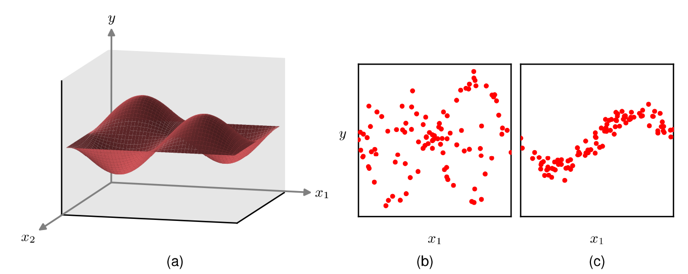
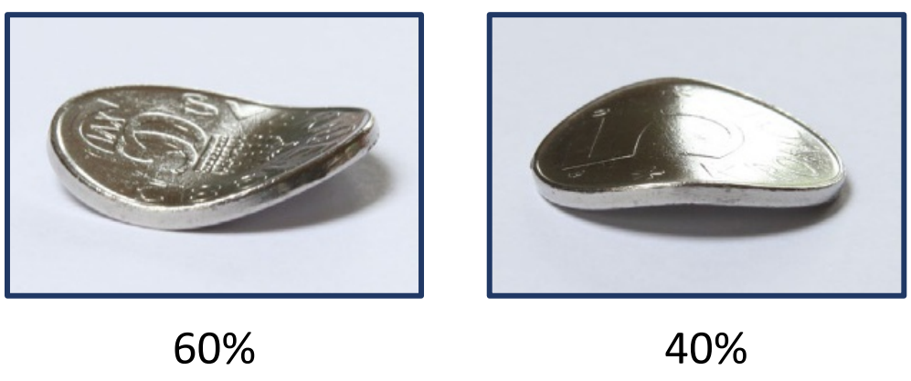
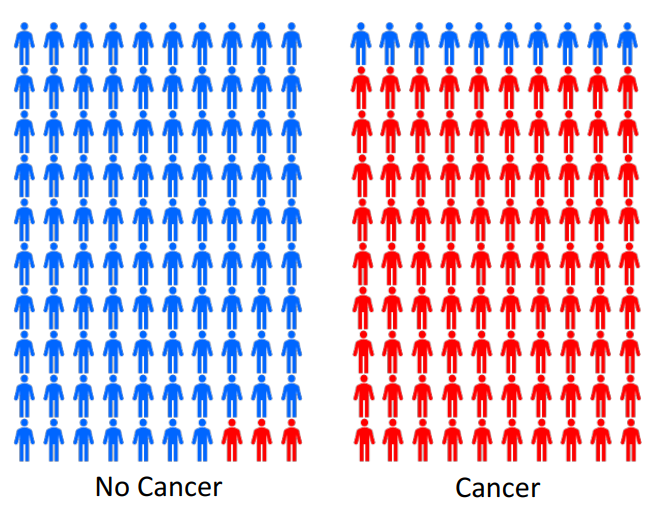
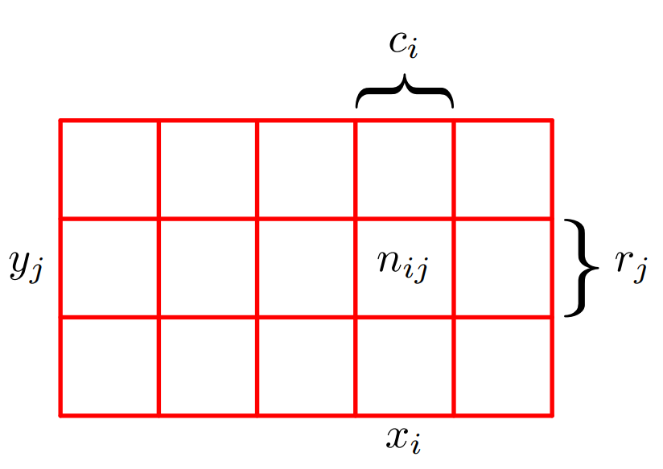

<!--
_class: title
-->
# Deep Learning: Foundations and Concepts 2024

2024/4/18 Daiki Yoshikawa

---
<!--
class: slides
footer: 2024/04/18Deep Learning:Foundations and Concepts 2024
paginate: true
-->
# 目次
- 2 Probabilities
  - 2.1 The Rules of Probability  
    - 2.1.1 A medical screening example
    - 2.1.2 The sum and product rules
    - 2.1.3 Bayes’theorem
    - 2.1.4 Medical screening revisited
    - 2.1.5 Prior and posterior probabilities
    - 2.1.6 Independent variables

---
# 2 Probabilities

- 機械学習では不確実性に常に直面する
- 2種類の不確実性
  - **epistemic uncertainty (認識論的)**
    - 有限のデータセットサイズに起因
    - より多くのデータを観測することで軽減可能
  - **aleatoric uncertainty (確率的)**
    - 観測が部分的にしかできない事に起因
    - 異なる種類のデータを集めることで軽減可能
---
# 2 Probabilities
- 確率論のフレームワーク
  - 不確実性の定量化と操作が可能
  - 機械学習の基礎となる
- 和の法則と積の法則
  - 決定理論と合わさることで最適な予測が可能

---
# 2 Probabilities

**ex) 曲がったコイン**
- 凹面が60%凸面が40%の確率で出るコインを仮定
  → 無限回の試行における定義
- コインの形がわからない時,結果を予測するには？
  → 対称性からそれぞれ50%を仮定するのが合理的

---
# 2 Probabilities
**頻度論的確率**
  - 再現可能な試行の頻度に基づいて確率を定義

**ベイズ論的確率**
  - 不確実性の定量化の観点から確率を定義
  - 特別な場合として頻度論的確率を含む

---
# 2.1 The Rules of Probability

## シンプルかつパワフルな確率論の基本法則
  - 加法則
  - 乗法則

---
# 2.1.1 A medical screening example

- がん早期発見のための集団検診
- 1%の人が実際にがんを患っている
- 検査の精度:
  - 偽陽性率 = 3%
  - 偽陰性率 = 10%

**このとき**
  1. 陽性反応の確率は?
  2. 陽性の場合がんである
     確率は?

---
# 2.1.2 The sum and product rules

- $x_i\ (i = 1,\ldots,L)$ : 確率変数$X$の取り得る値
- $y_j\ (j = 1,\ldots,M)$ : 確率変数$Y$の取り得る値
- $n_{ij}$ : $X=x_i,\ Y=y_j$となった回数
- $c_i$ : $X=x_i$となった回数
- $r_j$ : $Y=y_j$となった回数
- $N$ : 全試行回数

---
# 2.1.2 The sum and product rules
結合確率:
$$p(X=x_i, Y=y_j) = \frac{n_{ij}}{N} \tag{2.1}$$
Yに関係なくXが$x_i$となる確率:
$$p(X=x_i) = \frac{c_i}{N} \tag{2.2}$$
$\sum_i{c_i}=N$だから
$$\sum_{i=1}^L{p(X=x_i)} = 1 \tag{2.3}$$

---
# 2.1.2 The sum and product rules

---
# 2.1.2 The sum and product rules

- **加法則**:
  $$p(X) = \sum_Y p(X, Y)$$

- **乗法則**:
  $$p(X, Y) = p(Y|X)p(X)$$
- 確率を支配する基本的な法則

---
## 2.1.3 Bayes' theorem

$$p(Y|X) = \frac{p(X|Y)p(Y)}{p(X)}$$

- "逆向き"の条件付き確率の関係を示す

---
## 2.1.3 Bayes' theorem

- 事前確率: $p(C)$
- 事後確率: $p(C|T)$
  - データを観測した後の確率

---
## 2.1.4 Medical screening revisited

- 加法則と乗法則を使って:
  - 陽性反応の確率: $p(T=1) = 0.0387$

---
## 2.1.4 Medical screening revisited

- ベイズの定理を使って:
  - 陽性の場合のがん確率: $p(C=1|T=1) = 0.23$
- 直感に反するが正しい
  - がんの事前確率が低い(1%)ため

---
## 2.1.5 Prior and Posterior Probabilities

- 事前確率: $p(C)$
  - 検査結果を観測する前の確率

---
## 2.1.5 Prior and Posterior Probabilities

- 事後確率: $p(C|T)$
  - 検査結果を観測した後の確率
- 例:
  - 事前確率 $p(C) = 1\%$
  - 事後確率 $p(C|T=1) = 23\%$
    - 陽性の場合、はるかに高い

---
## 2.1.6 Independent Variables

- $p(X, Y) = p(X)p(Y)$ の場合、$X$と$Y$は独立
- 例: コインを続けて投げる

---
## 2.1.6 Independent Variables

- 条件付き確率分布は変化しない:
  $$p(Y|X) = p(Y)$$
- 独立変数の場合:
  $$p(C|T) = p(C)$$
  - 検査結果はがんについて何も教えてくれない

---
# まとめ

- 確率論は不確実性を定量化するための一貫したフレームワークを提供する
- 主要な概念:
  - 加法則と乗法則
  - ベイズの定理
  - 事前確率と事後確率
  - 独立変数
- 多くの機械学習手法の基礎となる