<!--
_class: title
-->
<h1> 生成モデルを用いた 意味論的に自然な画像編集 </h1>

## 2025/05/04 勉強会
### 吉川 大貴

---
<!--
class: slides
footer: 2024/12/4 2025/05/03 勉強会
paginate: true
-->
# 目次
- 前提知識
- 関連研究
  - 線形ベクトル演算を定義する手法
  - ベクトル場を定義する手法
  - 曲線座標系を定義する手法
- 応用例

      

---
<!--
_class: eyecatch
--> 
# 前提知識

<!-- ---
# 前提知識
- 画像を自由に作り出すことはコンピュータビジョンの研究における究極のゴールの一つ [1]
- 深層生成モデルを用いた画像生成手法が提案されてきた
  - 例：GAN, VAE, 拡散モデル

[1] T. Aoshima, T. Matsubara (2023). Deep Curvilinear Editing: Commutative and Nonlinear Image Manipulation for Pretrained Deep Generative Model. CVPR
 -->

---
# 前提知識
## ◆ GAN (Generative Adversarial Networks) [2]
- 生成器は識別機を騙すように、識別器は偽物を見破るように交互に学習


[2] Goodfellow, I. J., et al. (2014). Generative adversarial nets NIPS

---
# 前提知識
## ◆ GAN (Generative Adversarial Networks) [2]
- 生成器 $G$ と識別器 $D$ の最適化問題

$$\min_G \max_D V(D, G) = \mathbb{E}_{x \sim p_{\text{data}}(x)}[\log D(x)] + \mathbb{E}_{z \sim p_(z)} [\log(1 - D(G(z)))]$$

---
# 前提知識

## ◆ VAE (Variational Autoencoder) [3]
- 潜在空間におけるデータの分布を学習
- 再構成誤差を最小化するように学習
- 学習後は潜在変数からデコーダーを用いてデータを生成


[3] Kingma, D. P., & Welling, M. (2013). Auto-encoding variational bayes ICLR

---
# 前提知識

## ◆ 多様体仮説
自然界に存在する高次元のデータの分布は低次元多様体として捉えることができるという仮説

- GAN, VAEではデータの低次元多様体を潜在表現として獲得

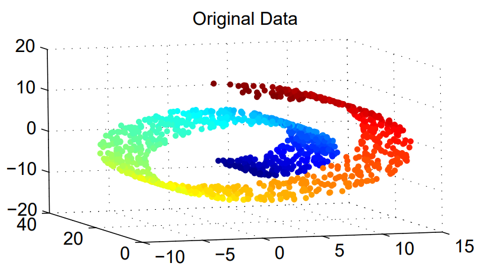
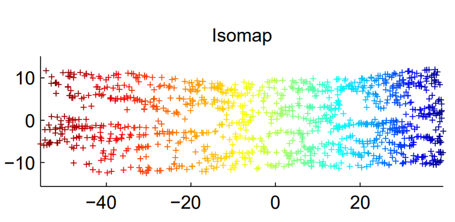
 

---
# 前提知識
## ◆ 潜在変数と画像編集
- 潜在変数には意味的な情報が含まれており、属性ベクトルの演算によって画像を編集することが可能

 

---
<!--
_class: eyecatch
-->
# 関連研究

<!-- ---
# 関連研究
- 自然で高精度な編集をするための手法が複数提案されている [1]
- 学習後の潜在空間を解析する手法では再学習が不要

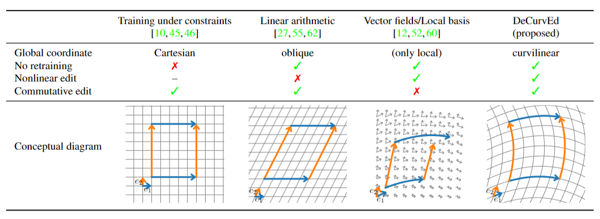

[1] T. Aoshima, T. Matsubara (2023). Deep Curvilinear Editing: Commutative and Nonlinear Image Manipulation for Pretrained Deep Generative Model. CVPR
 -->

---
# 線形ベクトル演算を定義する手法 [9]
生成器Gは固定したまま、次の2つを学習
1. 行列$A\in\mathbb{R}^{d\times K}$: K個の属性ベクトル
2. リンコンストラクタ$R$: 編集前後の画像から属性ベクトルと変化量を回帰

[9] A. Voynov, A. Babenko (2020) Unsupervised Discovery of Interpretable Directions in the GAN Latent Space

<!-- ---
# 関連研究
## 線形ベクトル演算を定義する手法の問題点
- 現実に存在するデータには偏りやゆがみ、属性間の相関がある
- 潜在空間中の基準点によって属性ベクトルの向きが異なる [10]
→属性ベクトルの向きを潜在空間の座標に依存させればよい

[10] V. Khrulkov, et al. (2021) Latent Transformations via NeuralODEs for GAN-based Image Editing

 -->

---
# ベクトル場を定義する手法[11]
- RBF(Radial Basis Function)の重み付き和で属性ごとのベクトル場を定義
$$
f(\mathbf{z}) = \sum_{i=1}^{N} \alpha_i \exp(-\gamma_i||\mathbf{z}-\mathbf{s}_i||^2)
$$
$$
\nabla f(\mathbf{z}) = \sum_{i=1}^{N} -2\gamma_i\alpha_i(\mathbf{z}-\mathbf{s}_i)\exp(-\gamma_i||\mathbf{z}-\mathbf{s}_i||^2)
$$

[11] C. Tzelepis, et al. (2021) WarpedGANSpace: Discovering and Interpolating Interpretable GAN Controls

    

---
# ベクトル場を定義する手法[11]
- 線形ベクトル演算を定義する手法と同じ、教師なしフレームワークで学習

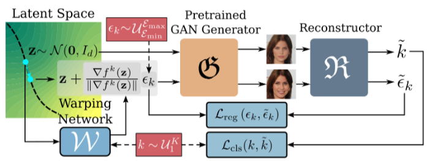

[11] C. Tzelepis, et al. (2021) WarpedGANSpace: Discovering and Interpolating Interpretable GAN Controls

  
---
# ベクトル場を定義する手法[11]
 

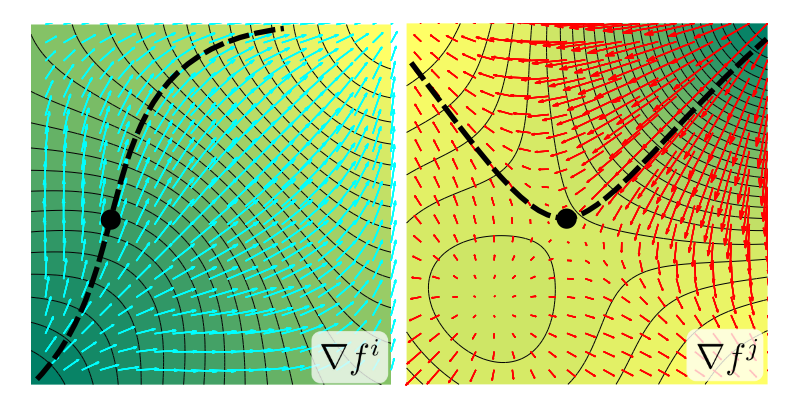
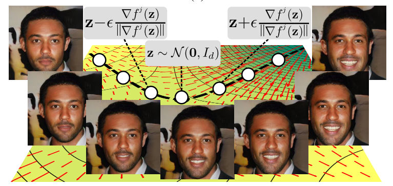

[11] C. Tzelepis, et al. (2021) WarpedGANSpace: Discovering and Interpolating Interpretable GAN Controls

  

<!-- ---
# 関連研究
## ベクトル場を定義する手法の問題点
- 座標が局所的にしか定義されていないため、大域的には不整合が起こる可能性がある [1]
- ベクトル場は一般に非可換であり、編集が非可換になる
  - 例：笑顔→年齢と年を年齢→笑顔の編集結果が異なる
  → 可換なベクトル場を定義する手法が必要

[1] T. Aoshima, T. Matsubara (2023). Deep Curvilinear Editing: Commutative and Nonlinear Image Manipulation for Pretrained Deep Generative Model. CVPR
 -->

---
# 曲線座標系を定義する手法 (DeCurvEd)[1]
- 潜在空間に曲線座標系を仮定し、直交座標系への写像$f:\mathcal{Z}\rightarrow \mathcal{V}$を学習

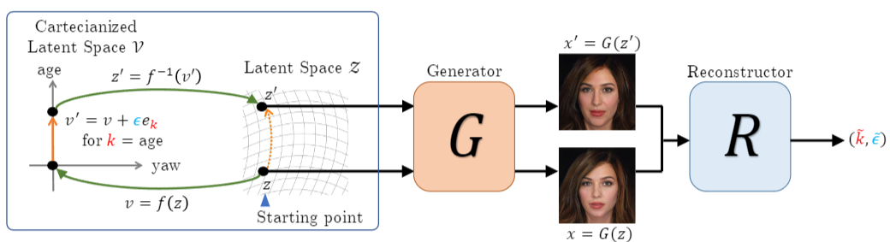

[1] T. Aoshima, T. Matsubara (2023). Deep Curvilinear Editing: Commutative and Nonlinear Image Manipulation for Pretrained Deep Generative Model. CVPR

    

---
# 曲線座標系を定義する手法 (DeCurvEd)[1]

 

**直交化潜在空間における編集**
$$
\psi_k^t(v) \coloneqq v + te_k.
$$

$$
(\psi_k^t \circ \psi_l^s)(v) = v + te_k + se_l = v + se_l + te_k = (\psi_l^s \circ \psi_k^t)(v).
$$

 

**潜在空間における編集**
$$
\phi_k^t\coloneqq f^{-1} \circ \psi_k^t \circ f.
$$

[1] T. Aoshima, T. Matsubara (2023). Deep Curvilinear Editing: Commutative and Nonlinear Image Manipulation for Pretrained Deep Generative Model. CVPR

    

---
# 曲線座標系を定義する手法 [1]
- DeCurvEdはベクトル場を定義する手法の特殊な場合
- 線形ベクトル演算を定義する手法はDeCurvEdの特殊な場合
→ 線形ベクトル演算、ベクトル場の両方の利点を持つ

<!-- 

[1] T. Aoshima, T. Matsubara (2023). Deep Curvilinear Editing: Commutative and Nonlinear Image Manipulation for Pretrained Deep Generative Model. CVPR
 -->

      

---
# 実験結果
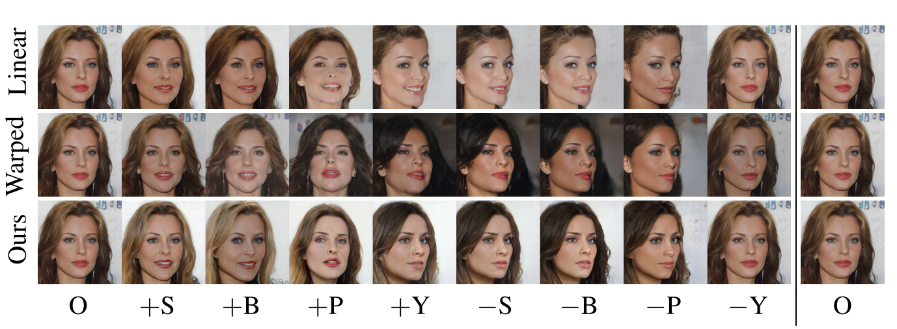

O: original, S: “smile”, B: “bangs”, P: “pitch”, Y: “yaw”. C: “hair color”, L: “hair length”.

      

---
# 実験結果
- Linearに次ぎ、DeCurvEdは可換性が高い

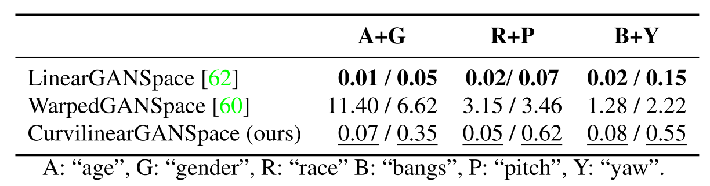

[1] T. Aoshima, T. Matsubara (2023). Deep Curvilinear Editing: Commutative and Nonlinear Image Manipulation for Pretrained Deep Generative Model. CVPR

      

---
# 応用例

- これらの研究のやりたいこととしては、「生成モデルが獲得した潜在空間の構造の理解」
- 関連する応用例を紹介する
  - Crypko (キャラクター生成)
  - 網膜画像の擬似症例生成
      

---
# [Crypko](https://crypko.ai/ja/) (キャラクター生成) 
## ◆ 概要
- PFNが開発した**キャラクター生成プラットフォーム**
- GANベースで、顔〜上半身を含む高品質な2Dキャラを自動生成

## ◆ 特徴と潜在空間の活用
- 潜在空間の構造を活かし、以下の操作が可能：
  - **キャラ同士の融合**（latent vectorの補間）
  - **髪色・目の色などの属性編集**
- 再学習不要、ユーザー操作のみで多様なキャラ生成が可能

[12] 

---
# [網膜画像の擬似症例生成](https://iotnews.jp/ai/125445/) [13]
## ◆ 概要
- 日本のスタートアップ「イーグロース」とツカザキ病院眼科が共同開発
- GANを用いて、**実在しない網膜剥離症例画像**を高精度に生成

## ◆ 技術のポイント
- 元画像の視神経・血管構造は保持したまま、病変のみを付加
- 特定の位置・組み合わせ（例：緑内障＋網膜剥離）での生成も可能

  
