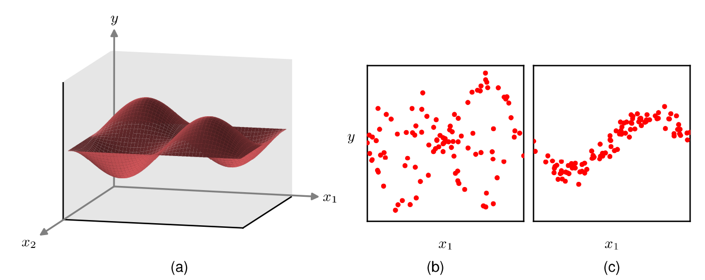
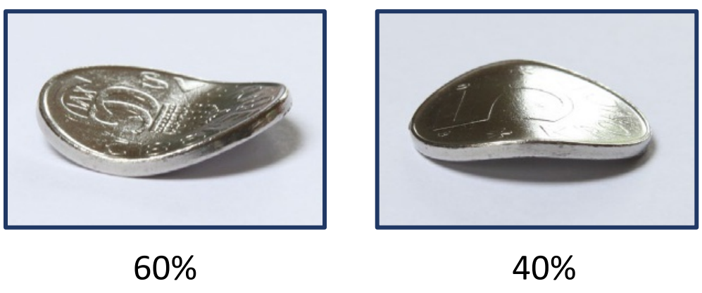
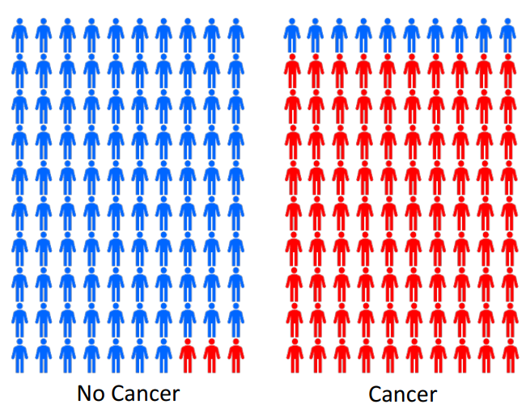
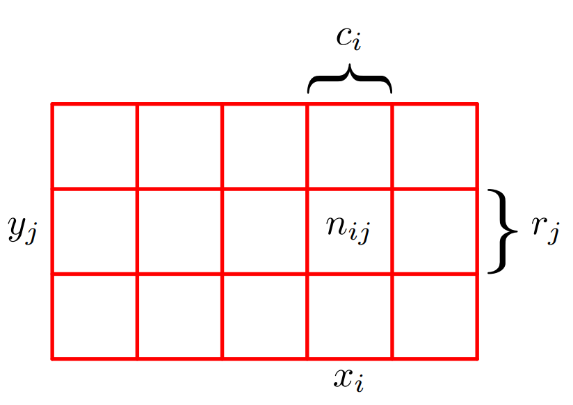
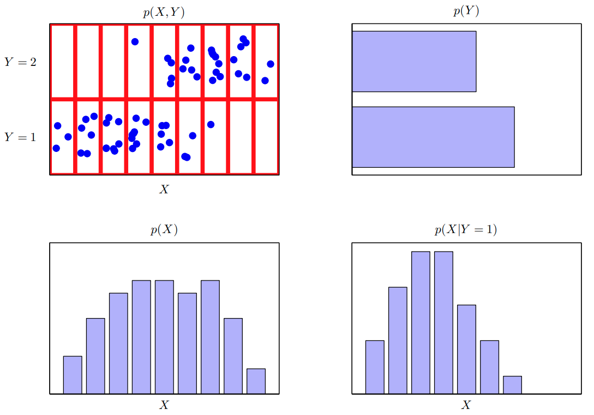

<!--
_class: title
-->
# Deep Learning: Foundations and Concepts 2024

Section: 2.1
2024/4/18 Daiki Yoshikawa

---
<!--
class: slides
footer: 2024/04/18Deep Learning:Foundations and Concepts 2024
paginate: true
-->
# 目次
- 2 Probabilities
  - 2.1 The Rules of Probability  
    - 2.1.1 A medical screening example
    - 2.1.2 The sum and product rules
    - 2.1.3 Bayes’theorem
    - 2.1.4 Medical screening revisited
    - 2.1.5 Prior and posterior probabilities
    - 2.1.6 Independent variables

---
# 2 Probabilities

- 機械学習では不確実性に常に直面する
- 2種類の不確実性
  - **epistemic uncertainty (認識論的)**
    - 有限のデータセットサイズに起因
    - より多くのデータを観測することで軽減可能
  - **aleatoric uncertainty (確率的)**
    - 観測が部分的にしかできない事に起因
    - 異なる種類のデータを集めることで軽減可能
---
# 2 Probabilities
確率的不確実性軽減の例
- $x_2$が観測されない場合ノイズが大きい (b)
- $x_2$が観測されるとノイズが小さくなる (c)

<figure>

<figcaption>図 2.1 </figcaption>
</figure>

---
# 2 Probabilities
- 確率論のフレームワーク
  - 不確実性の定量化と操作が可能
  - 機械学習の基礎となる
- 和の法則と積の法則
  - 決定理論と合わさることで最適な予測が可能

---
# 2 Probabilities

**ex) 曲がったコイン**
- 凹面が60%凸面が40%の確率で出ると仮定
  → 無限回の試行における定義
- 形がわからない時, 結果を予測するには？
  → 対称性からそれぞれ50%を仮定するのが合理的

<figure>

<figcaption>図 2.2 </figcaption>
</figure>

---
# 2 Probabilities
**頻度論的確率**
  - 再現可能な試行の頻度に基づいて確率を定義

**ベイズ論的確率**
  - 不確実性の定量化の観点から確率を定義
  - 特別な場合として頻度論的確率を含む

---
# 2.1 The Rules of Probability

## 確率論の基本法則
  - 和の法則
  - 積の法則

→シンプルさとは裏腹に、強力であり
　多くの問題に適用可能

---
# 2.1.1 A medical screening example

- がん早期発見のための集団検診
- 1%の人が実際にがんを患っている
- 検査の精度:
  - 偽陽性率 = 3%
  - 偽陰性率 = 10%

**このとき**
  1. 陽性反応の確率は?
  2. 陽性の場合がんである
     確率は?

<figure>

<figcaption>図 2.3 </figcaption>
</figure>

---
# 2.1.2 The sum and product rules

- $x_i\ (i = 1,\ldots,L)$ : 確率変数$X$の取り得る値
- $y_j\ (j = 1,\ldots,M)$ : 確率変数$Y$の取り得る値
- $n_{ij}$ : $X=x_i,\ Y=y_j$となった回数
- $c_i$ : $X=x_i$となった回数
- $r_j$ : $Y=y_j$となった回数
- $N$ : 全試行回数
<figure>

<figcaption>図 2.4 </figcaption>
</figure>

---
# 2.1.2 The sum and product rules
結合確率:
$$p(X=x_i, Y=y_j) = \frac{n_{ij}}{N} \tag{2.1}$$
Yに関係なくXが$x_i$となる確率:
$$p(X=x_i) = \frac{c_i}{N} \tag{2.2}$$
$\sum_i{c_i}=N$だから
$$\sum_{i=1}^L{p(X=x_i)} = 1 \tag{2.3}$$

---
# 2.1.2 The sum and product rules
$c_i=\sum_j{n_{ij}}$と(2.1), (2.2)より
$$\small p(X=x_i) = \sum_{j=1}^{M}{p(X=x_i, Y=y_j)} \tag{2.4}$$
→**確率の和の法則**
- 周辺確率とも呼ばれる
- Yについて足し合わせる(周辺化)ことで得られる

---
# 2.1.2 The sum and product rules
$X=x_i$のインスタンスのみを考える
$Y=y_j$となる割合:
$$p(Y=y_j|X=x_i) = \frac{n_{ij}}{c_i} \tag{2.5}$$
→**条件付き確率**

$\sum_j{n_{ij}=c_i}$より以下を得る
$$\sum_{j=1}^{M}{p(Y=y_j|X=x_i)} = 1 \tag{2.6}$$

---
# 2.1.2 The sum and product rules
(2.1), (2.2), (2.5)より
$$\small p(X=x_i,Y=y_j) = \frac{n_{ij}}{N} = \frac{n_{ij}}{c_i}\cdot\frac{c_i}{N}$$
$$\small =p(Y=y_i|X=x_i)p(X=x_i)\tag{2.7}$$
→**確率の積の法則**

---
# 2.1.2 The sum and product rules

- **和の法則**:
  $$p(X) = \sum_Y p(X, Y)\tag{2.8}$$
- **積の法則**:
  $$p(X, Y) = p(Y|X)p(X)\tag{2.9}$$

---
# 2.1.3 Bayes' theorem

$$p(Y|X) = \frac{p(X|Y)p(Y)}{p(X)}\tag{2.10}$$

和の法則を用いて分母を変形：
$$p(X)=\sum_Y{p(X|Y)p(Y)}\tag{2.11}$$

---
# 2.1.3 Bayes' theorem

<figure>

<figcaption>図 2.5 </figcaption>
</figure>

---
# 2.1.4 Medical screening revisited
Medical screeningの問題に和と積の法則を適用する

$C$: がんの有無 (0: なし, 1: あり)

$$\small p(C=1) = 1/100 \tag{2.12}$$
$$\small p(C=0) = 99/100 \tag{2.13}$$

$T$: 検査の結果 (0: 陰性, 1: 陽性)

$$\small p(T=1|C=1) = 90/100 \tag{2.14}$$
$$\small p(T=0|C=1) = 10/100 \tag{2.15}$$
$$\small p(T=1|C=0) = 3/100 \tag{2.16}$$
$$\small p(T=0|C=0) = 97/100 \tag{2.17}$$

---
# 2.1.4 Medical screening revisited
以下の条件を満たすよう正規化されている:
$$\scriptsize p(T=1|C=1)+ p(T=0|C=1) = 1 \tag{2.18}$$
$$\scriptsize p(T=1|C=0)+ p(T=0|C=0) = 1 \tag{2.19}$$
Q1.陽性反応の確率は?
$$\scriptsize p(T=1) = p(T=1|C=0)p(C=0) + p(T=1|C=1)p(C=1)$$
$$\scriptsize = \frac{3}{100}\times\frac{99}{100}+\frac{90}{100}\times\frac{1}{100}=0.0387 \tag{2.20}$$

しかし...
実際には1%しか"がん"を患っていない

---
# 2.1.4 Medical screening revisited
Q2.陽性の場合がんである確率は?
$$\scriptsize p(C=1|T=1) = \frac{p(T=1|C=1)p(C=1)}{p(T=1)}\tag{2.21}$$
$$\scriptsize = \frac{90}{100}\times\frac{1}{100}\times\frac{10,000}{387}=\frac{90}{387} \simeq 0.23 \tag{2.22}$$

---
# 2.1.5 Prior and Posterior Probabilities

- 事前確率: $p(C)$
  - 検査結果を観測する前の確率
- 事後確率: $p(C|T)$
  - 検査結果を観測した後の確率

がん検査の例:
  - 事前確率 $p(C) = 1\%$
  - 事後確率 $p(C|T=1) = 23\%$

---
# 2.1.6 Independent Variables

- $p(X, Y) = p(X)p(Y)$ の場合、$X$と$Y$は独立

ex) コインを続けて投げる
- 条件付き確率は変化しない:
  $$p(Y|X) = p(Y)$$
- 検査結果とがんの有無が独立の場合:
  $$p(C|T) = p(C)$$
  →検査結果はがんについて何も教えてくれない
