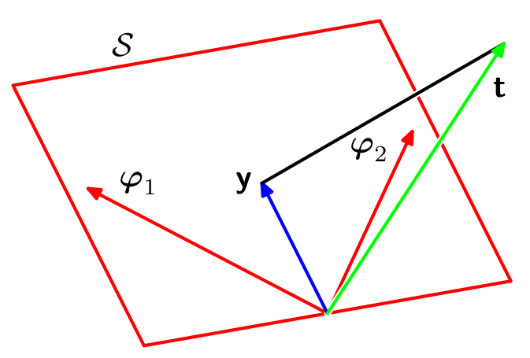
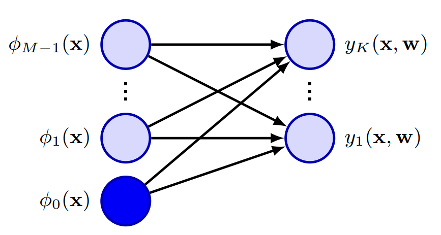
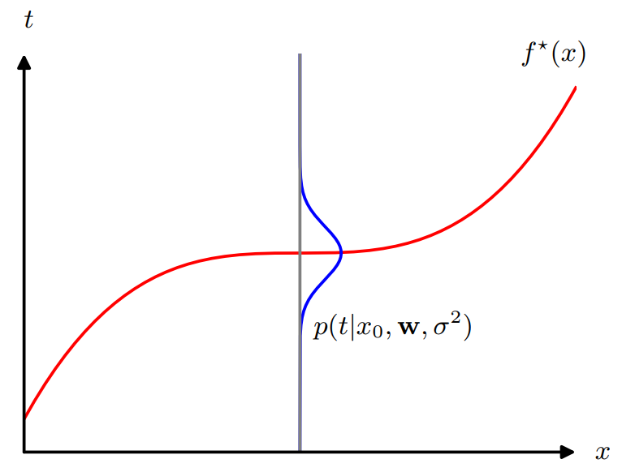
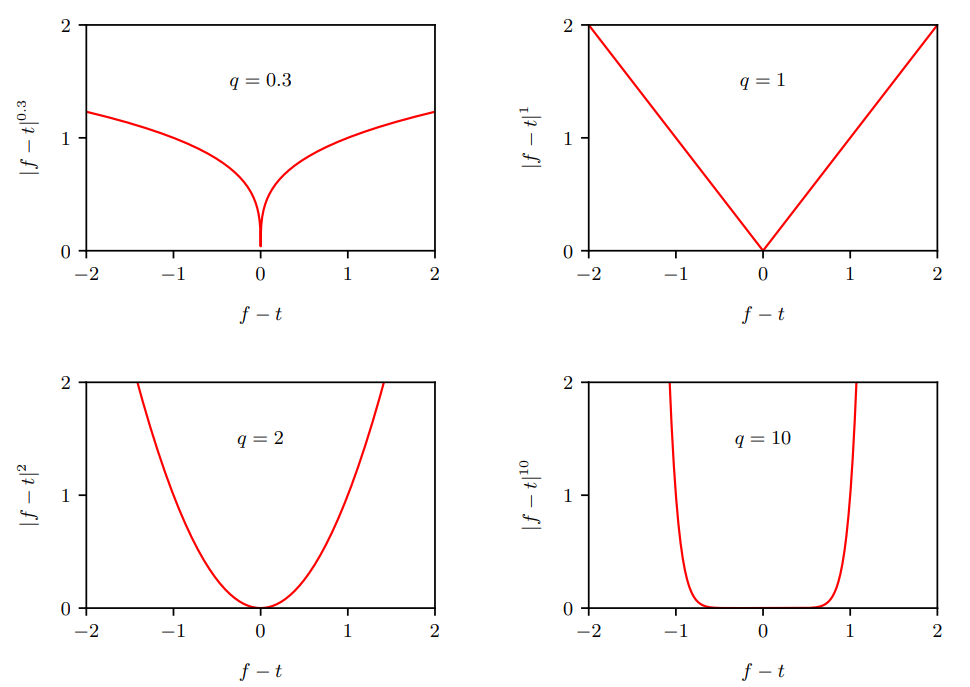

<!--
_class: title
-->
# Deep Learning: Foundations and Concepts 2024

Section: 4.1.2 - 4.2
2024/5/9 Daiki Yoshikawa

---
<!--
class: slides
footer: 2024/04/18Deep Learning : Foundations and Concepts 2024
paginate: true
-->
# 目次
- 4.1 Linear Regression
  - 4.1.2 Likelihood function
  - 4.1.3 Maximum likelihood
  - 4.1.4 Geometry of least squares
  - 4.1.5 Sequential learning
  - 4.1.6 Regularized least squares
  - 4.1.7 Multiple outputs
- 4.2 Decision theory
---
# 4.1.2 Likelihood function
- 最小二乗法と最尤推定の関係をより詳細に議論
- 目的変数$t$は決定論的関数$y(\mathbf{x},\mathbf{w})$と加法性ノイズ$\epsilon$によって決まると仮定する:
$$t = y(\mathbf{x},\mathbf{w}) + \epsilon \tag{4.7}$$
- $\epsilon$は平均0、分散$\sigma^2$のガウス分布に従うと仮定する
- このとき$t$の条件付き分布は:
$$p(t|\mathbf{x},\mathbf{w}, \sigma^2) = \mathcal{N}(t|y(\mathbf{x},\mathbf{w}), \sigma^2) \tag{4.8}$$

---
# 4.1.2 Likelihood function

- 入力$\mathbf{X}=\{\mathrm{x_1, \ldots,x_N}\}$と目的変数$t_1,\ldots,t_N$からなるデータセットを考える
  - $\{t_n\}$を列ベクトルにまとめたものを$\pmb{\mathsf{t}}$とする
- (4.8)の分布から独立に得られた点と仮定する
- 尤度関数は次のようになる($\mathbf{w}$と$\sigma^2$がパラメータ):
$$p(\pmb{\mathsf{t}}|\mathbf{X}, \mathbf{w}, \sigma^2) = \prod_{n=1}^N \mathcal{N}(t_n|\mathbf{w}^T\phi(\mathbf{x}_n), \sigma^2) \tag{4.9}$$

---
# 4.1.2 Likelihood function
- 尤度関数の対数をとり、標準形を用いる(2.49)
$$\begin{align}
\ln p(\pmb{\mathsf{t}}|X, \mathbf{w}, \sigma^2) &= \sum_{n=1}^N \ln \mathcal{N}(t_n|\mathbf{w}^T\phi(\mathbf{x}_n), \sigma^2)\\
&= -\frac{N}{2}\ln(\sigma^2) - \frac{N}{2}\ln(2\pi)- \frac{1}{\sigma^2}E_D(\mathbf{w}) 
\tag{4.10}\end{align}$$
- $E_D(\mathbf{w})$は二乗和誤差関数:
$$E_D(\mathbf{w}) = \frac{1}{2}\sum_{n=1}^N\{t_n - \mathbf{w}^T\phi(\mathbf{x}_n)\}^2\tag{4.11}$$

---
# 4.1.2 Likelihood function
$$\begin{align}
\ln p(\pmb{\mathsf{t}}|X, \mathbf{w}, \sigma^2)
&= -\frac{N}{2}\ln(\sigma^2) - \frac{N}{2}\ln(2\pi)- \frac{1}{\sigma^2}E_D(\mathbf{w}) 
\end{align}$$
- 最初の2項は$\mathbf{w}$に依存しないため、定数として扱える
- 尤度関数を最大化することは二乗和誤差関数(4.11)の最小化と等価

---
# 4.1.3 Maximum likelihood
- 最尤推定を用いてパラメータ$\mathbf{w}$と$\sigma^2$を推定
- (4.10)の$\mathbf{w}$に沿った勾配を計算すると:
$$\nabla_{\mathbf{w}}\ln p(\pmb{\mathsf{t}}|\mathbf{X}, \mathbf{w}, \sigma^2) = \frac{1}{\sigma^2}\sum_{n=1}^N(t_n - \mathbf{w}^T\phi(\mathbf{x_n}))\phi(\mathbf{x_n})^T\tag{4.12}$$
- 勾配を0とすると
$$0=\sum_{n=1}^N{t_n\phi(\mathbf{x_n})^T}- \mathbf{w}^T\left(\sum_{n=1}^N{\phi(\mathbf{x_n})\phi(\mathbf{x_n})^T}\right)\tag{4.13}$$

---
# 4.1.3 Maximum likelihood
- (4.13)を$\mathbf{w}$について解くことで以下を得る
$$\mathbf{w}_{ML} = \left(\mathbf\Phi^T\mathbf\Phi\right)^{-1}\mathbf\Phi^T\pmb{\mathsf{t}}\tag{4.14}$$
- 最小二乗問題の正規方程式 (*normal equations* ) とも呼ばれる
- $\mathbf\Phi$は$N\times M$行列で、計画行列 (*design matrix* )と呼ばれる
$$
\mathbf\Phi = \begin{pmatrix}
\phi_0(\mathbf{x}_1) & \phi_1(\mathbf{x}_1) & \ldots & \phi_{M-1}(\mathbf{x}_1) \\
\phi_0(\mathbf{x}_2) & \phi_1(\mathbf{x}_2) & \ldots & \phi_{M-1}(\mathbf{x}_2) \\
\vdots & \vdots & \ddots & \vdots \\
\phi_0(\mathbf{x}_N) & \phi_1(\mathbf{x}_N) & \ldots & \phi_{M-1}(\mathbf{x}_N) \\
\end{pmatrix}
\tag{4.15}
$$
---
# 4.1.3 Maximum likelihood
- $\mathbf\Phi$のMP疑似逆行列( *Moore-Penrose pseudo-inverse* )
$$\mathbf\Phi^\dagger \equiv (\mathbf\Phi^T\mathbf\Phi)^{-1}\mathbf\Phi^T\tag{4.16}$$
- 逆行列の概念を非正方行列に拡張したもの
- $\mathbf\Phi$が正方かつ逆行列が存在する場合、$\mathbf\Phi^\dagger \equiv \mathbf\Phi^{-1}$

---
# 4.1.3 Maximum likelihood
- バイアスパラメータを明示的に書くと(4.11)は以下のようになる
$$
E_D(\mathbf{w}) = \frac{1}{2}\sum_{n=1}^N\{t_n - w_0 - \sum_{j=1}^{M-1}w_j\phi_j(\mathbf{x}_n)\}^2
\tag{4.17}
$$
- (4.17)の$w_0$に関する導関数を0とし、$w_0$について解くと
$$
w_0 = \bar{t} - \sum_{j=1}^{M-1}w_j\bar{\phi}_j
\tag{4.18}
$$
$$
\bar{t} = \frac{1}{N}\sum_{n=1}^Nt_n, \quad \bar{\phi}_j = \frac{1}{N}\sum_{n=1}^N\phi_j(\mathbf{x}_n)
\tag{4.19}
$$

---
# 4.1.3 Maximum likelihood
- 対数尤度関数(4.10)を$\sigma^2$について最大化すると:
$$
\sigma^2_{ML} = \frac{1}{N}\sum_{n=1}^N\{t_n - \mathbf{w}_{ML}^T\phi(\mathbf{x}_n)\}^2
\tag{4.20}
$$
- 分散の最尤推定量は、目標変数の残差分散から得られる

---
# 4.1.4 Geometry of least squares

- **t** $=(t_1,\ldots,t_N)^T$が各軸となる$N$次元空間を考える
- 各基底関数$\phi_j(\mathbf{x}_n)$の値は同空間内のベクトルとして$\varphi_j$と表現される
- $M < N$のとき
  - $M$個のベクトル$\varphi_j(\mathbf{x}_n)$はM次元の線形部分空間$\mathcal{S}$を張る
- **y** を$n$番目の要素が$y(\mathbf{x}_n, \mathbf{w})$であるN次元ベクトルとする
  - $\varphi_j$の線形結合として表現可能
  - 二乗和誤差関数は**y**と**t**のユークリッド距離の二乗に対応
  - 最小二乗解の$\mathbf{w}$は**y**と**t**の最短距離を与える**y**に対応

<!-- 
図4.3: 2次元入力空間における
最小二乗解の幾何学的解釈 -->

---
# 4.1.4 Geometry of least squares

感覚的には...
  - 解は**t**の$\mathcal{S}$への直行射影に対応
  - **y**の解は$\mathbf{\Phi w}_{ML}$によって与えられる
    - これが直行射影の形をとっていること
    からもわかる

- $\mathbf{\Phi}^T\mathbf{\Phi}$が特異に近い場合、直接解法では
数値的困難が生じる

図4.3: 2次元入力空間における
最小二乗解の幾何学的解釈

---
# 4.1.4 Geometry of least squares
- $\mathbf{\Phi}^T\mathbf{\Phi}$が特異に近い場合
  - 特に２つ以上の$\varphi_j$が共線性またはそれに近い場合
  パラメータの絶対値が大きくなり得る
  - 実データを扱う場合は珍しくない
  - SVD (*singular value decomposition*)で解決
  - 正則化項を足すことで行列が非特異で有ることを保証

---
# 4.1.5 Sequential learning
- 最尤法(4.14)はデータセット全体を一括に処理する(*batch* 法)
  - 大規模データの場合、計算コストが高い
- 逐次 (*sequential* )・オンライン (*online* )学習が有用
  - 連続的な観測データから予測を行うような実時間アプリケーションにも有効
  - 確率的勾配降下法 (*stochastic gradient descent* ) が用いられる
    - *sequential gradient descent* とも呼ばれる

---
# 4.1.5 Sequential learning

- 確率的勾配降下法を用いて誤差関数を最適化
- 誤差関数が$E = \sum_{n}E_n$のとき、更新式は:
$$\mathbf{w}^{(\tau+1)} = \mathbf{w}^{(\tau)} - \eta \nabla E_n\tag{4.21}$$
- $\tau$はイテレーション番号、$\eta$は学習率
- 二乗和誤差関数 (4.11)の場合:
$$\mathbf{w}^{(\tau+1)} = \mathbf{w}^{(\tau)} + \eta(t_n - \mathbf{w}^{(\tau)T}\phi_n)\phi_n\tag{4.22}$$
- $\phi_n=\phi(\mathbf{x}_n)$であり、LMS (*least mean squares, LMS* )アルゴリズムとして知られる 

---
# 4.1.6 Regularized least squares
- 正則化によりモデルの複雑さを制御して過学習を防ぐ
- 誤差関数は次の形式 ($\lambda$は正則化係数) :
$$E(\mathbf{w}) = E_D(\mathbf{w}) + \lambda E_W(\mathbf{w})\tag{4.23}$$  
- シンプルな例として、重みベクトルの二乗和がある
$$E_W(\mathbf{w}) = \frac{1}{2}\sum_j w_j^2 = \frac{1}{2}\mathbf{w}^T\mathbf{w}\tag{4.24}$$

---
# 4.1.6 Regularized least squares
- 次のような二乗和誤差関数を考える:
$$E_D(\mathbf{w}) = \frac{1}{2}\sum_{n=1}^N\{t_n - \mathbf{w}^T\phi(\mathbf{x}_n)\}^2 \tag{4.25}$$
- 全体の誤差関数は次のようになる:
$$\frac{1}{2}\sum_{n=1}^N\{t_n - \mathbf{w}^T\phi(\mathbf{x}_n)\}^2 + \frac{\lambda}{2}\mathbf{w}^T\mathbf{w}\tag{4.26}$$

---
# 4.1.6 Regularized least squares
$$\frac{1}{2}\sum_{n=1}^N\{t_n - \mathbf{w}^T\phi(\mathbf{x}_n)\}^2 + \frac{\lambda}{2}\mathbf{w}^T\mathbf{w}$$
- 統計学において、パラメーター縮小推定 ( *parameter shrinkage* ) の一例
- $\mathbf{w}$の2次関数として、閉形式で解が得られる
- (4.26)の$\mathbf{w}$に沿った勾配を0にし、$\mathbf{w}$について解くと:
$$\mathbf{w} = (\lambda I + \mathbf\Phi^T\mathbf\Phi)^{-1}\mathbf\Phi^T\pmb{\mathsf{t}}\tag{4.27}$$
- 通常の最小二乗解の拡張形

---
# 4.1.7 Multiple outputs
- 今までは目的変数tが1変数の場合を扱った
- 複数の変数 $\pmb{\mathsf{t}} = (t_1, \ldots, t_K)^T, K>1$ を予測したい
- $\pmb{\mathsf{t}}$のそれぞれの成分に異なる基底関数の集合を使うことで実現可能
  - より一般的な方法として、全ての目的変数を同じ基底関数でモデル化する
$$
\mathbf{y}(\mathbf{x}, \mathbf{w}) = \mathbf{W}^T\phi(\mathbf{x})\tag{4.28}
$$
$\mathbf{y}$: K次元列ベクトル　$\mathbf{W}$: $M\times K$ 行列　$\phi(\mathbf{x})$: M次元列ベクトル

---
# 4.1.7 Multiple outputs
- 単層のニューラルネットワークとして表現できる (図4.4)

 

 図4.4: 複数の出力に対する単層ニューラルネットワーク表現

---
# 4.1.7 Multiple outputs
- 目的変数の条件付き分布として次を仮定する:
  $$p(\mathbf{t}|\mathbf{x}, \mathbf{W}, \sigma^2) = \mathcal{N}(\mathbf{t}|\mathbf{W}^T\phi(\mathbf{x}), \sigma^2\mathbf{I})\tag{4.29}$$
- 観測値$\mathbf{T} = (\mathbf{t}_1, \ldots, \mathbf{t}_N)^T$と入力値$\mathbf{X} = (\mathbf{x}_1, \ldots, \mathbf{x}_N)^T$に対する
対数尤度は:
$$\begin{align}
\ln p(\mathbf{T}|\mathbf{X}, \mathbf{W}, \sigma^2) 
&= \sum_{n=1}^N{\ln{\mathcal{N}(\mathbf{t}_n|\mathbf{W}^T\phi(\mathbf{x}_n),\sigma^2\mathbf{I})}} \\
&= -\frac{NK}{2}\ln(2\pi\sigma^2) - \frac{1}{2\sigma^2}\sum_{n=1}^N||\mathbf{t}_n - \mathbf{W}^T\phi(\mathbf{x}_n)||^2 \ \ (4.30)
\end{align}$$

---
# 4.1.7 Multiple outputs
- $\mathbf{W}$について最大化すると解は:
$$\mathbf{W}_{ML} = (\mathbf{\Phi}^T\mathbf{\Phi})^{-1}\mathbf{\Phi}^T\mathbf{T}\tag{4.31}$$
- $t_k$それぞれについて見ると
$$\mathbf{w}_k = (\mathbf{\Phi}^T\mathbf{\Phi})^{-1}\mathbf{\Phi}^T\pmb{\mathsf{t}}_k=\mathbf{\Phi}^\dagger\pmb{\mathsf{t}}_k\tag{4.32}$$

---
# 4.2 Decision theory
- 予測分布 ( *predictive distribution* ) を考える
$$
p(t|\mathbf{x}, \mathbf{w}_{\text{ML}}, \sigma^2_{\text{ML}}) =
\mathcal{N}(t|y(\mathbf{x}, \mathbf{w}_{\text{ML}}), \sigma^2_{\text{ML}})\tag{4.33}
$$
- 実際には、分布ではなく値を使いたい
  - 例) 腫瘍の治療のための放射線量を予測する場合、予測分布から特定の線量を決定する必要がある
- 推論 ( *inference* ) 段階:
  - 訓練データから予測分布$p(t|\mathbf{x})$を計算
- 決定 ( *decision* ) 段階:
  - 予測分布から特定の値$f(\mathbf{x})$を計算

---
# 4.2 Decision theory
- 予測分布 $p(t|\mathbf{x})$ と $f$ の両方に依存する損失関数 ( *loss function* ) を最小化
- 直感的には、平均を選べば$f(\mathbf{x})=y(\mathbf{x},\mathbf{w}_{\text{ML}})$
  - 場合によっては非常に悪い予測になってしまうことも
  - どのような場合にどのような仮定のもとで適用するかを理解することが重要
    - 決定理論 (*decision theory* )によって形式化

---
# 4.2 Decision theory
- 損失関数 $L(t, f(\mathbf{x}))$ によって予測の良し悪しを評価
- 真値$t$はわからないので、代わりに平均損失を最小化
$$
\mathbb{E}[L] = \int\int L(t, f(\mathbf{x}))p(\mathbf{x}, t)d\mathbf{x}dt\tag{4.34}
$$
- 二乗損失 $L(t,f(\mathbf{x})={f(\mathbf{x})-t}^2)$を用いると
$$
\mathbb{E}[L] = \int\int \{f(\mathbf{x}) - t\}^2p(\mathbf{x}, t)d\mathbf{x}dt\tag{4.35}
$$
- 二乗損失と二乗和誤差関数を混同しないように注意

---
# 4.2 Decision theory
- 目標は$\mathbb{E}[L]$を最小にする$f(\mathbf{x})$を見つけること
- $f(\mathbf{x})$を完全に柔軟な関数と仮定すると、変分法を用いることができる
$$
\frac{\delta\mathbb{E}[L]}{\delta f(\mathbf{x})}
= 2\int\{f(\mathbf{x}) - t\}p(t|\mathbf{x})dt = 0\tag{4.36}
$$
- $f(\mathbf{x})$について解いて和と積の法則を用いると:
$$
f^*(\mathbf{x}) = \frac{1}{p(\mathbf{x})}\int tp(\mathbf{x},t)dt = \int tp(t|\mathbf{x})dt= \mathbb{E}[t|\mathbf{x}]\tag{4.37}
$$

---
# 4.2 Decision theory
- 回帰関数 ( *regression function* )
  - $\mathbf{x}$で条件づけした$t$の平均値
  - 多次元の出力にも拡張可能
  - (4.8)の場合、条件付き平均は

$\ \ \ \ \mathbb{E}[t|\mathbf{x}] = \int tp(t|\mathbf{x})dt = y(\mathbf{x}, \mathbf{w}) \ \ \ (4.38)
$

図4.5: 二乗損失を最小にする回帰関数

---
# 4.2 Decision theory
- 別の方法で同じ結果を導く
- 最適解が条件付き期待値であるという知識を用いると次のように展開できる
$$
\begin{align}
&\{f(\mathbf{x})-t\}^2 = \{f(\mathbf{x})-\mathbb{E}[t|\mathbf{x}]+\mathbb{E}[t|\mathbf{x}]-t\}^2 \\
&= \{f(\mathbf{x})-\mathbb{E}[t|\mathbf{x}]\}^2 + 2\{f(\mathbf{x})-\mathbb{E}[t|\mathbf{x}]\}\{\mathbb{E}[t|\mathbf{x}]-t\} + \{\mathbb{E}[t|\mathbf{x}]-t\}^2
\end{align}
$$
- 損失関数(4.35)に代入し、tについて積分すると以下を得る
$$
\mathbb{E}[L] = \int\{f(\mathbf{x})-\mathbb{E}[t|\mathbf{x}]\}^2p(\mathbf{x})d\mathbf{x} + \int \text{var}[t|\mathbf{x}]p(\mathbf{x})d\mathbf{x}\tag{4.39}
$$

---
# 4.2 Decision theory
$$
\mathbb{E}[L] = \int\{f(\mathbf{x})-\mathbb{E}[t|\mathbf{x}]\}^2p(\mathbf{x})d\mathbf{x} + \int \text{var}[t|\mathbf{x}]p(\mathbf{x})d\mathbf{x}
$$
- 第一項は$f(\mathbf{x})=\mathbb{E}[t|\mathbf{x}]$のとき最小かつ0となり、これは条件付き平均値
- 第二項は$\mathbf{x}$上で平均化された$t$の分散であり、ノイズとみなすことができる
  - $f(\mathbf{x})$について独立なため、第二項が損失の最小値

---
# 4.2 Decision theory
- 二乗損失を一般化した損失を考える
- ミンコフスキー (*Minkowski* )損失の期待値
$$
\mathbb{E}[L_q] = \int\int |f(\mathbf{x})-t|^q p(\mathbf{x}, t)d\mathbf{x}dt\tag{4.40}
$$
- $\mathbb{E}[L_q]$の最小値
  - $q=2$のとき、条件付き平均
  - $q=1$のとき、条件付き中央値
  - $q\rightarrow0$のとき、条件付きモード

---
<!--
_class: image_center
-->
# 4.2 Decision theory

図4.6: $L_q=|f-t|^q$のプロット

---
# 4.2 Decision theory
- ガウスノイズの仮定は$t$の条件付き分布が単峰性を持つことを意味
  - 二乗損失では悪い結果になってしまう場合がある
  - 混合ガウスを用いて拡張可能
    - 逆問題 (*inverse problem* ) で用いられる
- 次章では分類問題に対する同様の概念を議論する