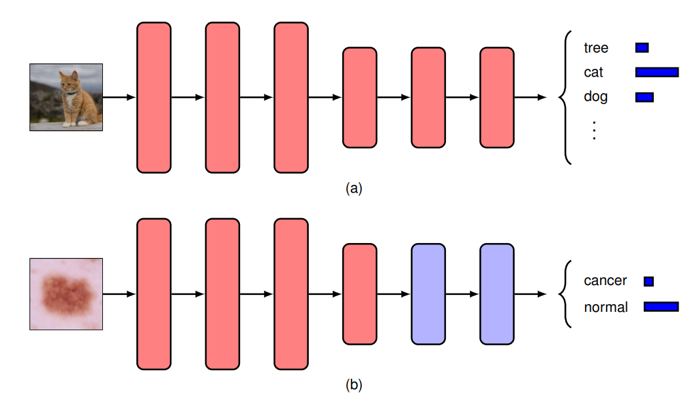
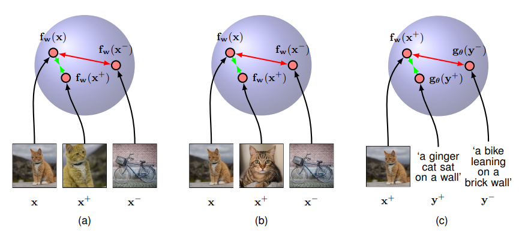
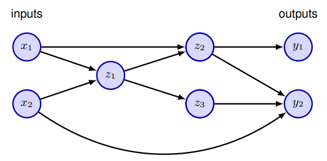

<!--
_class: title
-->
# Deep Learning: Foundations and Concepts 2024

Section: 6.3.4 ~ 6.4
2024/6/6 Daiki Yoshikawa

---
<!--
class: slides
footer: 2024/06/06Deep Learning : Foundations and Concepts 2024
paginate: true
-->
# 目次
- 6.3 Deep Networks
  - 6.3.4 Transfer learning
  - 6.3.5 Contrastive learning
  - 6.3.6 General network architectures
  - 6.3.7 Tensors
- 6.4 Error Functions
  - 6.4.1 Regression
  - 6.4.2 BInary classification
  - 6.4.3 multiclass classification

---
<!--
_class: eyecatch
-->
# 6.3.4 Transfer learning

---
# 6.3.4 Transfer learning

- 1つのタスクで学習した内部表現を、関連するタスクに転移させる手法
- 大量のデータから学習した表現を、少数のデータで別のタスクに転移
  - 例: 大量のラベル付き一般物体画像から学習したネットワークを、皮膚病変検出に転移学習
- 少量のデータだけで学習するより高い精度を実現可能

---

図6.13 転移学習の模式図

---
# 6.3.4 Transfer learning
## 転移学習の要件

- 入力データが同種である (画像、テキストなど)
- 低次の特徴量が共通している
    - 例: 物体認識と皮膚病変検出では、低次の特徴が共通

適切に転移学習を行えば、ターゲットタスクの性能が大幅に向上する

---
# 6.3.4 Transfer learning
## 事前学習 (*pre-training*)
- あるタスクでパラメータを学習し、他のタスクに適用するプロセス
- 新しいタスクにおいては、識別層を含む一部の層のみを再学習
- ファインチューニング (*fine-tuning*) では、全ての層を再学習
  - 非常に小さい学習率とイテレーション数で学習することで
    過学習を防ぐ

---
# 6.3.4 Transfer learning
## マルチタスク学習 (*multitask learning*)
- 複数のタスクを同時に学習する手法
- 例： スパムメールフィルターをユーザーごとに学習したい場合
  - ユーザーごとのデータのみで学習するにはデータが不十分
  - 浅い層は共通、深い層はユーザーごとのパラメータをもつ１つのネットワークを学習
  - タスク間の共通性を利用することが可能

---
# 6.3.4 Transfer learning
## メタ学習 (*meta-learning*)
- タスク間の内部表現や学習アルゴリズム自体を学習する手法
- 新しいクラスのラベル付きデータが少ない場合に有効
  - **few-shot learning**: ラベル付きデータが少量の場合
  - **one-shot learning**: ラベル付きデータが1つの場合

---
<!--
_class: eyecatch
-->
# 6.3.5 Contrastive learning

---

# 6.3.5 Contrastive learning
- 最も一般的で強力な表現学習の手法の1つ
- 入力ペアのうち、ポジティブ（類似）なペアを近くに、ネガティブ（非類似）なペアを遠くに配置するように学習
- 分類などの下流タスクを容易にする

---
# 6.3.5 Contrastive learning
### $\mathbf{x}$ (*anchor*)が与えられたとき
  - $\mathbf{x^+}$: ポジティブペアを成すデータ点
  - $\{\mathbf{x}_1^-,\ldots,\mathbf{x}_N^-\}$: ネガティブペアを成すデータ点の集合
  - $\mathbf{x}$と$\mathbf{x}^+$の近さに報酬、$\{\mathbf{x}, \mathbf{x}_n^-\}$の近さにペナルティを与えるような損失関数が必要

**InfoNCE (noise contrastive estimation)損失関数:**
$$
{E}(\mathbf{w}) = -\ln \frac{\exp\{\mathbf{f}_w(\mathbf{x})^\top \mathbf{f_w}(\mathbf{x}^+)\}}{\exp\{\mathbf{f_w}(\mathbf{x})^\top \mathbf{f_w}(\mathbf{x}^+)\} + \sum_{n=1}^N \exp\{\mathbf{f_w}(\mathbf{x})^\top \mathbf{f_w}(\mathbf{x}_n^-)\}}
$$

---
# 6.3.5 Contrastive learning

- 対照学習のアルゴリズムはポジティブ、ネガティブのペアの選び方で主に決まる
  →事前知識を使って良い表現がどうあるべきかを指定
## 画像の場合
- 意味的な情報を保存しつつ入力画像を改変しポジティブペアとする
- データ拡張 (*data augmentation*) に密接に関連
  - 回転、平行移動、色変換など
- その他の画像はネガティブペアとする

→ **Instance Discrimination**と呼ばれる

---
# 6.3.5 Contrastive learning

## 教師付き対比学習
- 同一クラスの画像ペアをポジティブ、異なるクラスの画像ペアをネガティブペアとする
  - 拡張方法への依存の緩和
  - 意味的に近いペアをネガティブペアにすることを防ぐ
- クロスエントロピー損失を用いた通常の学習よりも性能が向上

---

# 6.3.5 Contrastive learning
## CLIP (Contrastive Language-Image Pre-training)
- 複数のモダリティからのデータを同じ表現空間に写す手法
- 画像とその説明文のペアをポジティブペアとする
- 画像とミスマッチな説明文のペアをネガティブペアとする
- 弱教師あり (*weakly supervised*) と呼ばれる

$$
\begin{align*}
E(\mathbf{w}) &= -\frac{1}{2}\ln\frac{\exp\{{f_w(x)^\top g_\theta(y^+)}\}}{\exp\{{f_w(x^+)^\top g_\theta(y^+)}\} + \sum_n \exp\{{f_w(x_n^-)^\top g_\theta(y^+)}\}} \\
                       &-\frac{1}{2}\ln\frac{\exp\{{f_w(x)^\top g_\theta(y^+)}\}}{\exp\{{f_w(x)^\top g_\theta(y^+)}\} + \sum_m \exp\{{f_w(x)^\top g_\theta(y_m^-)}\}}
                       \ \ \ \ (6.21)
\end{align*}
$$
---
# 6.3.5 Contrastive learning

図6.14 ３つの対照学習の模式図

---
<!--
_class: eyecatch
-->
# 6.3.6 General network architectures

---
# 6.3.6 General network architectures

- より一般的なネットワーク構造を考える
- フィードフォワード構造 (閉路がない) に限定
  - 出力が入力の決定論的関数であることを保証
- 各ユニットで計算される関数は次のよう

$$z_k = h\left(\sum_{j \in \mathcal{A}(k)} w_{kj}z_j + b_k\right) \tag{6.22}$$
$\mathcal{A}(k)$: ノード$k$の祖先ノード (*ancestors*)の集合
$b_k$: バイアス項

---
<!--
_class: image_center
-->
# 6.3.6 General network architectures
$$z_k = h\left(\sum_{j \in \mathcal{A}(k)} w_{kj}z_j + b_k\right)$$

図 6.15：一般化されたニューラルネットワーク

---
<!--
_class: eyecatch
-->
# 6.3.7 Tensors

---
# 6.3.7 Tensors

- スカラー、ベクトル、行列を一般化した多次元配列
- 深層学習では様々な階数のテンソル (*tensors*)を扱う
- 例: カラー画像データセット $\mathcal{X}$
    - $x_{ijkn}$: 画像 $n$, 色チャンネル $k$, 画素位置 $(i, j)$ の値
- GPUはテンソル演算に特化した並列アーキテクチャ

---
<!--
_class: eyecatch
-->
# 6.4 Error Functions

---
# 6.4 Error Functions

- 5章では、回帰・分類問題における線形モデルで適切な誤差関数を導出
- 同様の議論が多層ニューラルネットワークにも適用可能
→重要な点を要約

---
<!--
_class: eyecatch
-->
# 6.4.1 Regression

---
# 6.4.1 Regression

- 目標変数 $t$ の条件付き分布を正規分布と仮定:
    $$p(t|\mathbf{x}, \mathbf{w}) = \mathcal{N}(t|y(\mathbf{x}, \mathbf{w}), \sigma^2) \tag{6.23}$$
- $\sigma^2$はガウスノイズと仮定
  - 応用によってはより一般的な分布への拡張が必要
- 活性化関数は恒等写像 $y_k = a_k$で十分
  - 任意の連続関数を近似可能

---
# 6.4.1 Regression
- N個のi.i.d.な観測値と対応する目標変数が与えられたときの尤度関数は
$$
p(\pmb{\mathsf{t}}|\mathbf{X}, \mathbf{w}, \sigma^2) = \prod_{n=1}^N p(t_n|y(\mathbf{x}_n, \mathbf{w}), \sigma^2) \tag{6.24}
$$
- 機械学習の文献では、誤差関数の最小化を考えることが一般的
$$
\frac{1}{2\sigma^2}\sum_{n=1}^N \{y(\mathbf{x}_n, \mathbf{w})-t_n\}^2 + \frac{N}{2}\ln\sigma^2 + \frac{N}{2}\ln(2\pi) \tag{6.25}
$$

---

# 6.4.1 Regression

- (6.25)を用いて初めに$\mathbf{w}$を最適化

$${E}(\mathbf{w}) = \frac{1}{2}\sum_{n=1}^N \{y(\mathbf{x}_n, \mathbf{w})-t_n\}^2 \tag{6.26}$$

- $E(\mathbf{w})$の最小化で得られる$\mathbf{w}$を$\mathbf{w}^*$とする
  - $E(\mathbf{w})$が非凸のとき、大域的最小値とは限らない
- $\mathbf{w}^*$が得られた後、(6.25)を最適化することで次を得る
$$\sigma^{2*} = \frac{1}{N}\sum_{n=1}^N \{y(\mathbf{x}_n, \mathbf{w}^*)-t_n\}^2 \tag{6.27}$$

---

# 6.4.1 Regression
## 複数の目標変数

$$p(\mathbf{t}|\mathbf{x}, \mathbf{w}) = \mathcal{N}(\mathbf{t}|y(\mathbf{x}, \mathbf{w}), \sigma^2\bf{I}) \tag{6.28}$$

- 一変数の場合と同様の議論が適用可能
$${E}(\mathbf{w}) = \frac{1}{2}\sum_{n=1}^N ||\mathbf{y}(\mathbf{x}_n, \mathbf{w})-\mathbf{t}_n||^2 \tag{6.29}$$
$$\sigma^{2*} = \frac{1}{NK}\sum_{n=1}^N ||\mathbf{y}(\mathbf{x}_n, \mathbf{w}^*)-\mathbf{t}_n||^2 \tag{6.30}$$
$$K:\text{目標変数の次元数}$$

---
# 6.4.1 Regression
- 回帰においては、恒等写像の活性化関数をもつネットワークとみなせる
- 二乗和誤差関数は次の性質を持つ
$$
\frac{\partial E}{\partial a_k} = y_k - t_k \tag{6.31}
$$

---
<!--
_class: eyecatch
-->
# 6.4.2 Binary classification

---
# 6.4.2 Binary classification
- canonical link functionの議論に則ってロジスティックシグモイド関数を活性化関数として持つネットワークを考える
  - $0\le y(\mathbf{x},\mathbf{w})\le1$を条件とする
  - $y(\mathbf{x},\mathbf{w})$を条件付き確率$p(\mathcal{C}_1|\mathbf{x})$と解釈できる
- 目標変数の条件付確率はベルヌーイ分布となる
$$
p(t|\mathbf{x}, \mathbf{w}) = y(\mathbf{x}, \mathbf{w})^t\{1-y(\mathbf{x}, \mathbf{w})\}^{1-t} \tag{6.32}
$$

---
# 6.4.2 Binary classification
- 独立な観測データが与えられたときの誤差関数は次の形の交差エントロピー (*cross-entropy*)誤差となる
$$
E(\mathbf{w}) = -\sum_{n=1}^N \{t_n\ln y_n + (1-t_n)\ln(1-y_n)\} \tag{6.33}
$$
- $y_n$は$n$番目の観測データに対するモデルの出力$y(\mathbf{x}_n, \mathbf{w})$を表す
- 誤ったラベリングがされる確率$\epsilon$を導入することでラベルノイズの考慮も可能

---
# 6.4.2 Binary classification

## 複数の二値分類

- それぞれロジスティックシグモイドを活性化関数とする$K$個の出力を持つネットワークを考える
- クラスラベルの独立性を仮定すると、目標変数の条件付き分布と誤差関数は次のよう
$$
p(\mathbf{t}|\mathbf{x}, \mathbf{w}) = \prod_{k=1}^K y(\mathbf{x}, \mathbf{w})^{t_k}[1-y(\mathbf{x}, \mathbf{w})]^{1-t_k} \tag{6.34}
$$

$$
{E}(\mathbf{w}) = -\sum_{n=1}^N\sum_{k=1}^K \{t_{nk}\ln y_{nk} + (1-t_{nk})\ln(1-y_{nk})\} \tag{6.35}
$$

---
<!--
_class: eyecatch
-->
# 6.4.3 Multiclass classification

---
# 6.4.3 Multiclass classification
- $K$個の互いに排他的なクラスの分類問題を考える
- 誤差関数は多クラス交差エントロピー誤差となる

$$
{E}(\mathbf{w}) = -\sum_{n=1}^N\sum_{k=1}^K t_{kn}\ln y_k(\mathbf{x}_n, \mathbf{w}) \tag{6.36}
$$

- 出力活性化関数はソフトマックス関数となる

$$y_k(\mathbf{x}, \mathbf{w}) = \frac{\exp{(a_k(\mathbf{x}, \mathbf{w}))}}{\sum_j \exp{(a_j(\mathbf{x}, \mathbf{w}))}} \tag{6.37}$$

---
# 6.4.3 Multiclass classification

- 問題ごとに適切な出力ユニットの活性化関数と誤差関数が存在
- 次章ではマルチモーダルなネットワークの出力に関して条件付き分布と誤差関数を考える

| 問題         | 出力活性化関数           | 誤差関数                   | 
| :----------: | :----------------------: | :------------------------: | 
| 回帰         | 線形                     | 二乗和誤差                 | 
| 二クラス分類 | ロジスティック シグモイド | クロスエントロピー         | 
| 多クラス分類 | ソフトマックス           | 多クラスクロスエントロピー | 