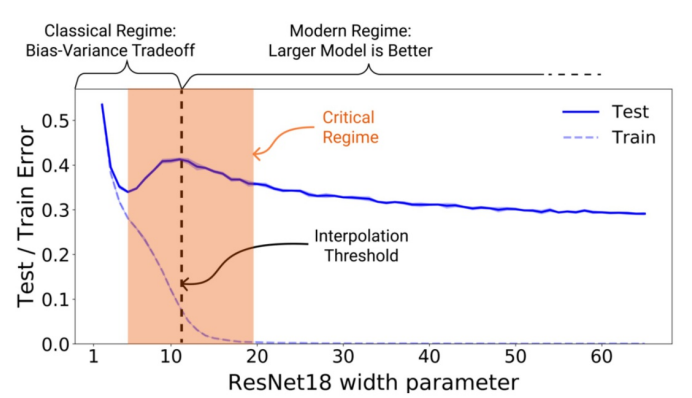
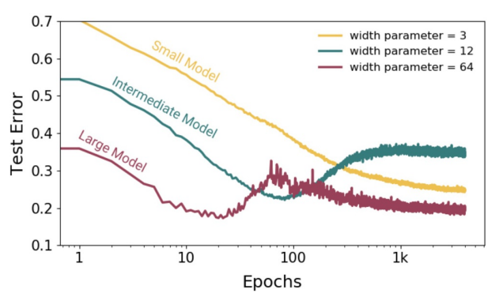
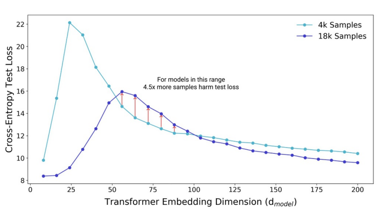

<!--
_class: title
-->
# Deep Learning: Foundations and Concepts 2024

Section: 9.3.2 ~ 9.4
2024/6/27 Daiki Yoshikawa

---
<!--
class: slides
footer: 2024/06/27Deep Learning : Foundations and Concepts 2024
paginate: true
-->
# 目次
- 9.3 Learning Curves
  - 9.3.2 Double descent
- 9.4 Parameter Sharing
  - 9.4.1 Soft weight sharing

---
<!--
_class: eyecatch
-->
# 9.3.2 Double descent

---
# 9.3.2 Double descent
## パラメータ数に対する従来の解釈

- モデルのパラメータ数を増やすと
  1. 表現力が向上し、検証エラーが減少(低バイアス)
  2. さらに増やすと過学習し、検証エラーが増加(高バリアンス)

  ⇒ **古典統計学における古説**
  - パラメータ数はデータセットの大きさに応じて制限
  - 非常に大きなモデルは性能が低い

---
# 9.3.2 Double descent
## DNNの実際の振る舞い
- 必要なパラメータ数を超えても高い性能を発揮することがある (Zhang et al., 2016)
- Early Stoppingが使用されて誤差ゼロまで学習されることがあり、その場合でも良好な性能を発揮

  ⇒従来の解釈と実際の振る舞いが矛盾？

---
# 9.3.2 Double descent
## 二重降下 (Double Descent, Belkin et al., 2019)
- 学習曲線,モデルの複雑と汎化性能の関係から矛盾は解消される

 
 図 9.9 パラメータ数と誤差の関係 

---
# 9.3.2 Double descent
## 二重降下 (Double Descent, Belkin et al., 2019)
- 二段階に分けることができる
  1. 小から中程度のパラメータ数
    → バイアス-バリアンストレードオフが成り立つ
  2. 非常に大きなパラメータ数
    → テスト誤差が再び減少する

⇒ 二つの段階の境界における
　パラメータ数は？

---
# 9.3.2 Double descent
## 二重降下 (Double Descent, Belkin et al., 2019)
- 訓練データに正確に適合するのに十分なパラメータ数のとき二回目の降下が発生 (Belkin et al., 2019)
- **effective model complexity** (Nakkiran et al., 2019)
  - 訓練誤差がゼロになる最大の訓練データ数
  - この値が訓練データ中のデータ数を超えると二重降下が発生

---
# 9.3.2 Double descent
## 二重降下と同様の振る舞い
- early stoppingを用いてモデルの複雑さを制御することで同様の振る舞いが観測される

 
 図 9.10 エポック数とテスト誤差の関係 

---
# 9.3.2 Double descent
## 二重降下と同様の振る舞い
- $1/\lambda$ (正則化パラメータ) に対するテスト誤差の関係においても二重降下が観測される
  - $\lambda$が大きいとモデルの複雑さが抑制されるため

---
# 9.3.2 Double descent
## データ数と汎化性能
- Transformerにて埋め込み次元を増やすとモデルの複雑さが上昇
- 埋め込み次元を増やすと
テスト誤差は(図9.11)
  - 全体的に減少
  - 臨界領域では上昇

⇒ **データ数を増やして汎化性能が
減少する可能性がある**

 
図 9.11 埋め込み次元数とテスト誤差の関係 

---
<!--
_class: eyecatch
-->
# 9.4 Parameter Sharing

---
# 9.4 Parameter Sharing
## パラメータ共有
- $L_2$正則化は重みを小さくすることで過学習を抑制
  - ネットワークの複雑さを制限する別の方法としてパラメータ共有
- 重みをグループに分け、各グループ内で重みが同じ値を取るように
  - *weight sharing, parameter sharing, parameter tying*
  - ネットワークの自由度 ＜ コネクション数
  - 帰納バイアスの導入方法
- CNNにおける畳み込みではパラメータ共有が用いられる

---
<!--
_class: eyecatch
-->
# 9.4.1 Soft weight sharing
---
# 9.4.1 Soft weight sharing
## 概要
- グループ内のパラメータが**近い**値を取るように正則化
- (9.1)の正則化はすべてのパラメータが0に近い値を取るようにする
$$\tilde{E}(\mathbf{w}) = {E}(\mathbf{w}) + \dfrac{\lambda}{2}\mathbf{w}^T\mathbf{w} \tag{9.1}$$
- ガウス混合モデルを用いることで複数のグループを形成し、各グループ内でパラメータが近い値を取るようにする
- 混合比率 $\{\pi_j\}$、平均 $\{\mu_j\}$、分散 $\{\sigma_j^2\}$ もデータから学習される

--- 
# 9.4.1 Soft weight sharing
## 重みの事前分布

- 重みwの事前分布をガウス混合モデルで定義
$$
p(\mathbf{w}) = \prod_i \left( \sum_{j=1}^{K} \pi_j \mathcal{N}(w_i|\mu_j, \sigma_j^2) \right)  \tag{9.21}
$$
- この事前分布の対数の負値を正則化関数 $\Omega(w)$ とする
$$
\Omega(\mathbf{w}) = -\sum_i \ln\left(\sum_{j=1}^{K} \pi_j \mathcal{N}(w_i|\mu_j, \sigma_j^2)\right) \tag{9.22}
$$

---
# 9.4.1 Soft weight sharing
## 誤差関数

- soft weight sharing正則化項を追加した誤差関数
$$
\tilde{E}(\mathbf{w}) = E(\mathbf{w}) + \lambda\Omega(\mathbf{w}) \tag{9.23}
$$
- $\{w_i\}$と$\{\pi_j, \mu_j, \sigma_j\}$それぞれについて勾配降下法で最小化する
- $\{\pi_j\}$を各ガウス成分が重みを生成した事前確率として解釈し、対応する事後確率を導入

$$
\gamma_j(w_i) = \dfrac{\pi_j \mathcal{N}(w_i|\mu_j, \sigma_j^2)}{\sum_{k} \pi_k \mathcal{N}(w_i|\mu_k, \sigma_k^2)} \tag{9.24}
$$

---
# 9.4.1 Soft weight sharing
## 誤差関数の勾配 (重み)

- 重み $w_i$ の勾配
$$\frac{\partial\tilde{E}}{\partial w_i} = \frac{\partial E}{\partial w_i} + \lambda\sum_j \gamma_j(w_i)\frac{w_i - \mu_j}{\sigma_j^2} \tag{9.25}
$$
⇒ それぞれの重みをグループ内の平均値に引き寄せる

---
# 9.4.1 Soft weight sharing
## 誤差関数の勾配 (平均)
- 平均 $\mu_j$ の勾配 
$$
\frac{\partial\tilde{E}}{\partial\mu_j} = \lambda\sum_i \gamma_j(w_i)\frac{\mu_j - w_i}{\sigma_j^2} \tag{9.26}
$$
⇒ $\mu_j$ をグループ内の重みの平均値へ押し出す

---
# 9.4.1 Soft weight sharing
## 誤差関数の勾配 (分散)
- $\{\sigma_j^2\}$が正になることを保証するために以下のように置く
$$
\sigma_j^2 = \exp(\xi_j) \tag{9.27}
$$
- 分散 $\sigma_j^2$ の勾配 ($\xi$の勾配)
$$
\frac{\partial\tilde{E}}{\partial\xi_j} = \frac{\lambda}{2}\sum_i \gamma_j(w_i)\left(1 - \frac{(w_i - \mu_j)^2}{\sigma_j^2}\right) \tag{9.28}
$$
⇒ $\sigma_j^2$ を$\mu_j$周りの重みの二乗偏差に近づける

---
# 9.4.1 Soft weight sharing
## 誤差関数の勾配 (混合係数)
- 混合係数 $\pi_j$ の制約を、補助変数 $\eta_j$とsoftmax関数を用いて表現
$$
\sum_j \pi_j = 1,\ 0 \le \pi_j \le 1 \tag{9.29}
$$
$$
\pi_j = \dfrac{\exp{\eta_j}}{\sum_{k=1}^K \exp{\eta_k}} \tag{9.30}
$$
- 混合係数 $\pi_j$ の勾配 ($\eta$の勾配)
$$
\frac{\partial\tilde{E}}{\partial\eta_j} = \lambda\sum_i \{\pi_j - \gamma_j(w_i)\}  \tag{9.31}
$$

---
# 9.4.1 Soft weight sharing
## 別の応用
- 教師なし生成モデルと教師あり識別モデルの組み合わせ (Lasserre, Bishop, Minka, 2006)
- ラベルなしデータが大量にあり、ラベル付きデータが少ない場合に有効
- 生成モデルの利点（未ラベルデータの活用）と識別モデルの利点（モデルの不適合への頑健性）を併せ持つことが可能
