<!--
_class: title
-->
# 2024年度 前期雑誌会

## 情報認識学研究室 M1 吉川 大貴

---
<!--
class: slides
footer: 2024/06/11Deep Learning : Foundations and Concepts 2024
paginate: true
-->
# 目次
- 研究背景
- 関連研究
  - GANSpace
  - WarpedGANSpace
  - CurvilinearGANSpace
- 修論に向けて

---
<!--
_class: eyecatch
--> 
# 研究背景

---
# 研究背景

- 画像を自由に作り出すことはコンピュータビジョンの研究における究極のゴールの一つである
- 深層生成モデルを用いた画像生成手法が提案されてきた。
  - 例：GAN, VAE, 拡散モデル

---
# 研究背景
## ◆ GAN (Generative Adversarial Networks) [1]
- 2つの敵対的なネットワークを競わせることで学習
- 生成器は識別機を騙すように、識別器は偽物を見破るように学習
- 学習後は潜在変数から生成器を通してデータを生成

---
# 研究背景
## ◆ GAN (Generative Adversarial Networks)
- 生成器 $G$ と識別器 $D$ の最適化問題
 

$$
\min_G \max_D V(D, G) = \mathbb{E}_{x \sim p_{\text{data}}(x)}[\log D(x)] + \mathbb{E}_{z \sim p_z(z)}[\log(1 - D(G(z)))]
$$

---
# 研究背景

## ◆ VAE (Variational Autoencoder)
- EMアルゴリズムと変分ベイズを融合させた手法
- 潜在空間におけるデータの分布を学習
- 学習後は潜在変数からデコーダーを用いてデータを生成

---
# 研究背景

- 深層生成モデルにおいて、生成される画像は潜在空間上の点の座標で決まる
  - 潜在変数の座標を操作することで画像編集が可能

---
# 研究背景
- 自然で高精度な編集をするための手法が複数提案されている

---
<!--
_class: eyecatch
-->
# 関連研究

---
# 関連研究
## 直交座標系を学習する手法
- 表現ベクトルの各要素に特定の属性が紐づけられるように学習
- 新しい目的関数を導入
  - 学習コストが高い
  - 学習が不安定化し、生成画像の品質が低下する

---
# 関連研究
## 線形ベクトル演算を定義する手法
- 学習済みモデルのパラメータを解析
- 潜在変数の分布を分析
- PCAを用いて潜在空間において属性に対応する主成分を抽出
- 潜在空間中の基準点によって属性ベクトルの向きが異なる

---
# 関連研究
## ベクトル場を定義する手法
- 属性ベクトルの向きを潜在空間の座標に依存する形で定義
- ベクトル場に沿うことで非線形な編集が可能
- 可換な編集は不可能

---
# 関連研究
## 曲線座標系を定義する手法
- 潜在空間に曲線座標系を仮定し、直交座標系を連続的に変化させたものとして学習
- 線形ベクトル演算、ベクトル場の両方の利点を持つ

---
<!--
_class: eyecatch
-->
# 修論に向けて

---
# 修論に向けて
- DeCurvEdは潜在変数に条件づけられた任意のモデルに適用可能
- VAE, Conditional PixelCNNといったモデルでも有効性を示す
- 生成モデルのアラインメント
  - 入力画像と異なるドメインの画像を生成
  例：人の顔写真にそっくりなPixar風の画像を生成
  　　犬にそっくりな猫の画像を生成