<!--
_class: title
-->
<h1> 生成モデルを用いた 意味論的に自然な画像編集 </h1>

## 2024年度 後期雑誌会
### 情報認識学研究室 M1 吉川 大貴

---
<!--
class: slides
footer: 2024/12/4 2024年度後期雑誌会
paginate: true
-->
# 目次
- 研究背景
- 関連研究
  - 線形ベクトル演算を定義する手法
  - ベクトル場を定義する手法
- 提案手法
  - 曲線座標系を定義する手法
  - 実験結果
- 修論に向けて

---
<!--
_class: eyecatch
--> 
# 研究背景

---
# 研究背景

- 画像を自由に作り出すことはコンピュータビジョンの研究における究極のゴールの一つ [1]
- 深層生成モデルを用いた画像生成手法が提案されてきた
  - 例：GAN, VAE, 拡散モデル

[1] T. Aoshima, T. Matsubara (2023). Deep Curvilinear Editing: Commutative and Nonlinear Image Manipulation for Pretrained Deep Generative Model. CVPR

---
# 研究背景
## ◆ GAN (Generative Adversarial Networks) [2]
- 2つの敵対的なネットワークを競わせることで学習
- 生成器は識別機を騙すように、識別器は偽物を見破るように学習
- 学習後は潜在変数から生成器を通してデータを生成

[2] Goodfellow, I. J., et al. (2014). Generative adversarial nets NIPS

---
# 研究背景
## ◆ GAN (Generative Adversarial Networks) [2]
- 生成器 $G$ と識別器 $D$ の最適化問題

$$
\min_G \max_D V(D, G) = \mathbb{E}_{x \sim p_{\text{data}}(x)}[\log D(x)] + \mathbb{E}_{z \sim p_z(z)}[\log(1 - D(G(z)))]
$$

[2] Goodfellow, I. J., et al. (2014). Generative adversarial nets NIPS

---
# 研究背景

## ◆ VAE (Variational Autoencoder) [3]
- EMアルゴリズムと変分ベイズを融合させた手法
- 潜在空間におけるデータの分布を学習
- 学習後は潜在変数からデコーダーを用いてデータを生成


[3] Kingma, D. P., & Welling, M. (2013). Auto-encoding variational bayes ICLR

---
# 研究背景

## ◆ 多様体仮説
自然界に存在する高次元のデータの分布が、低次元多様体の中に埋め込まれているとする仮説

- GAN, VAEではデータの低次元多様体を潜在表現として獲得していると捉えることができる

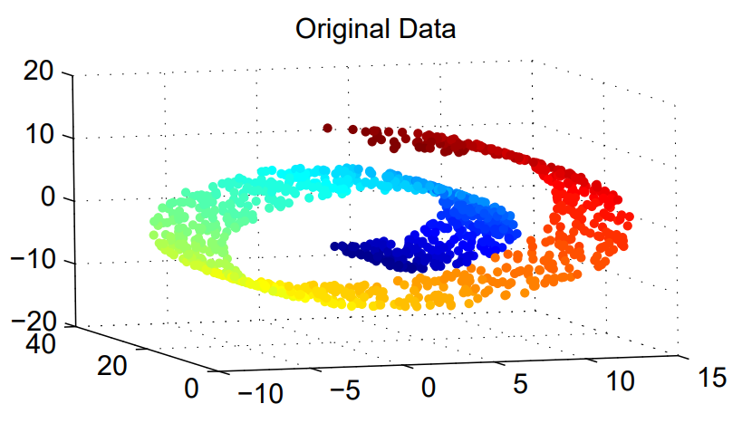
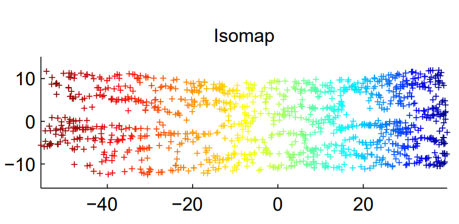

---
# 研究背景
## ◆ 潜在変数と画像編集
- 潜在変数には意味的な情報が含まれており、属性ベクトルの演算によって画像を編集することが可能

---
<!--
_class: eyecatch
-->
# 関連研究

---
# 関連研究
- 自然で高精度な編集をするための手法が複数提案されている [1]

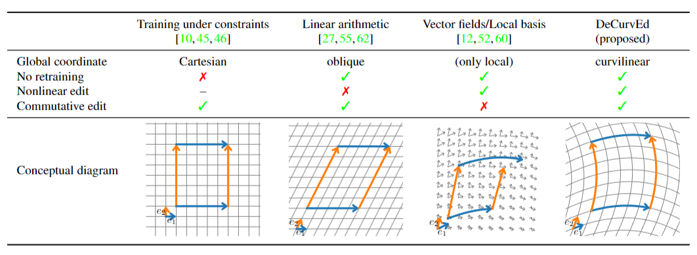

[1] T. Aoshima, T. Matsubara (2023). Deep Curvilinear Editing: Commutative and Nonlinear Image Manipulation for Pretrained Deep Generative Model. CVPR

---
# 関連研究
## 線形ベクトル演算を定義する手法 [9]
生成器Gは固定したまま、次の2つを学習
1. 行列$A\in\mathbb{R}^{d\times K}$: 属性インデックスから潜在変数の変化量を決定
2. リンコンストラクタ$R$: 編集前後の画像から属性ベクトルと変化量を回帰

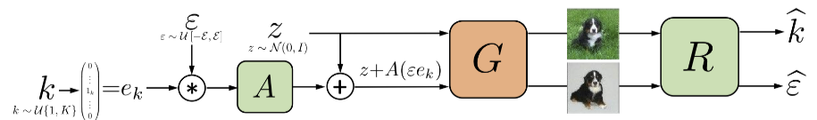

[9] A. Voynov, A. Babenko (2020) Unsupervised Discovery of Interpretable Directions in the GAN Latent Space

---
# 関連研究
## 線形ベクトル演算を定義する手法の問題点
- 現実に存在するデータには偏りやゆがみ、属性間の相関がある
- 潜在空間中の基準点によって属性ベクトルの向きが異なる [10]
→属性ベクトルの向きを潜在空間の座標に依存する形で定義

[10] V. Khrulkov, et al. (2021) Latent Transformations via NeuralODEs for GAN-based Image Editing

---
# 関連研究
## ベクトル場を定義する手法[11]
- RBF(Radial Basis Function)の重み付き和で属性ごとのベクトル場を定義
<!-- $$
f(\mathbf{z}) = \sum_{i=1}^{N} \alpha_i \exp(-\gamma_i||\mathbf{z}-\mathbf{s}_i||^2)
$$ -->

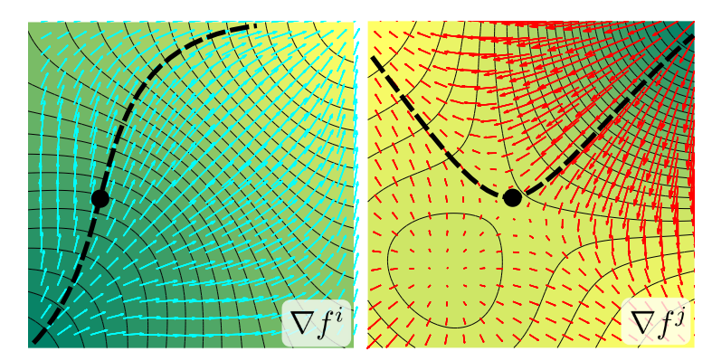
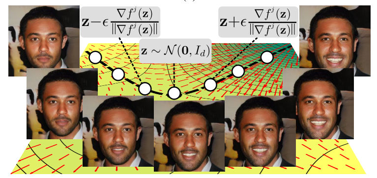

[11] C. Tzelepis, et al. (2021) WarpedGANSpace: Discovering and Interpolating Interpretable GAN Controls

---
# 関連研究
## ベクトル場を定義する手法[11]
- 線形ベクトル演算を定義する手法と同じ、教師なしフレームワークで学習

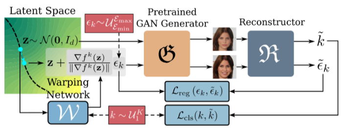

[11] C. Tzelepis, et al. (2021) WarpedGANSpace: Discovering and Interpolating Interpretable GAN Controls

---
# 関連研究
## ベクトル場を定義する手法の問題点
- 座標が局所的にしか定義されていないため、大域的には不整合が起こる可能性がある [1]
- ベクトル場は一般に非可換であり、編集が非可換になる
  - 例：笑顔→年齢と年を年齢→笑顔の編集結果が異なる
  → 可換なベクトル場を定義する手法が必要

[1] T. Aoshima, T. Matsubara (2023). Deep Curvilinear Editing: Commutative and Nonlinear Image Manipulation for Pretrained Deep Generative Model. CVPR

---
<!--
_class: eyecatch
-->
# 提案手法

---
# 提案手法
## 曲線座標系を定義する手法 [1]
- 潜在空間に曲線座標系を仮定し、直交座標系への写像$f:\mathcal{Z}\rightarrow \mathcal{V}$を学習

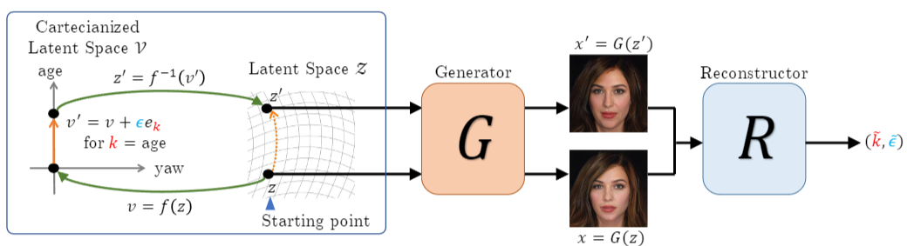

[1] T. Aoshima, T. Matsubara (2023). Deep Curvilinear Editing: Commutative and Nonlinear Image Manipulation for Pretrained Deep Generative Model. CVPR

---
# 提案手法
## 曲線座標系を定義する手法 [1]
- 線形ベクトル演算、ベクトル場の両方の利点を持つ

[1] T. Aoshima, T. Matsubara (2023). Deep Curvilinear Editing: Commutative and Nonlinear Image Manipulation for Pretrained Deep Generative Model. CVPR

---
# 提案手法
## 曲線座標系を定義する手法 [1]

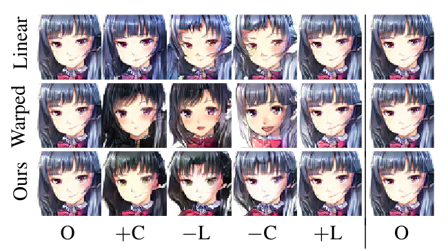

[1] T. Aoshima, T. Matsubara (2023). Deep Curvilinear Editing: Commutative and Nonlinear Image Manipulation for Pretrained Deep Generative Model. CVPR

---
<!--
_class: eyecatch
-->
# 修論に向けて

---
# 修論に向けて
- DeCurvEdは潜在変数に条件づけられた任意のモデルに適用可能
1. VAE, Conditional PixelCNNといったモデルでも有効性を示す
2. 生成モデルのアラインメント
    - 入力画像と異なるドメインの画像を生成
  例：人の顔写真にそっくりなPixar風の画像を生成

---
# 修論に向けて
## 生成モデルのアラインメント
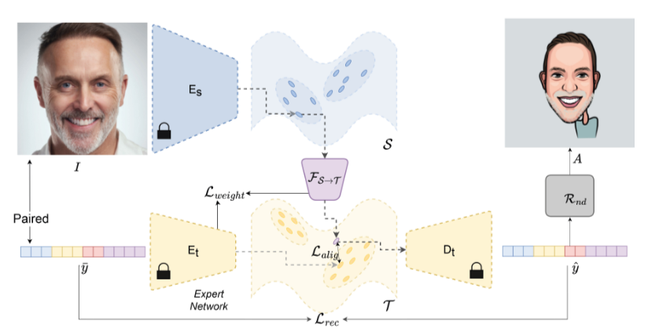

M. Ladron de Guevara, et al. (2023) Cross-modal Latent Space Alignment for Image to Avatar Translation.

